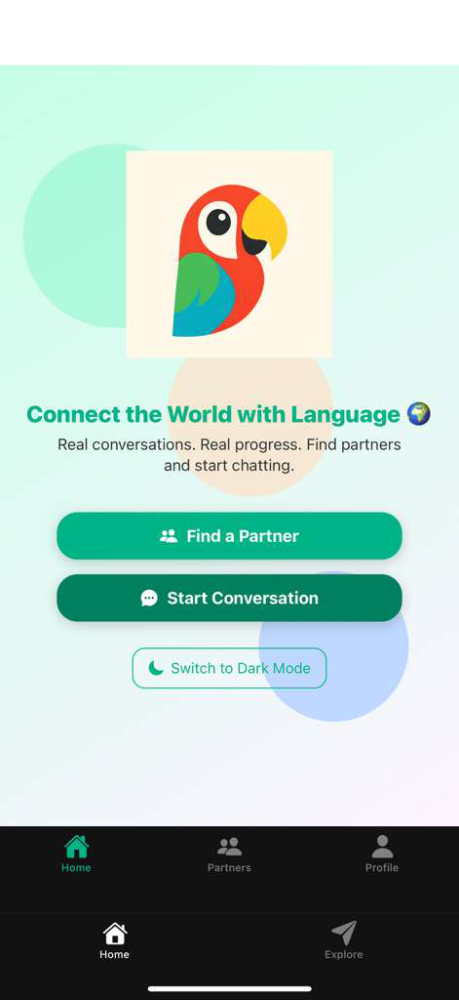
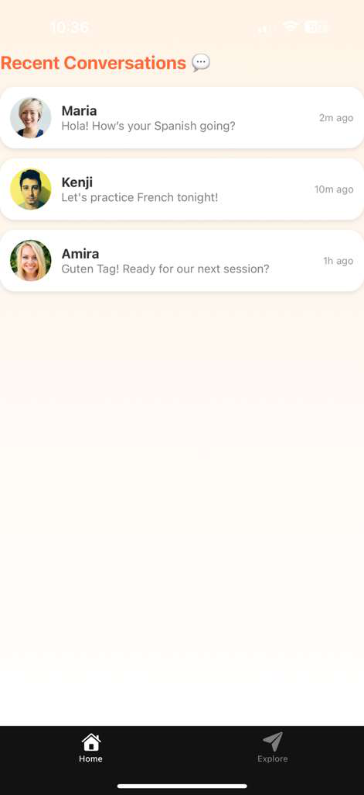
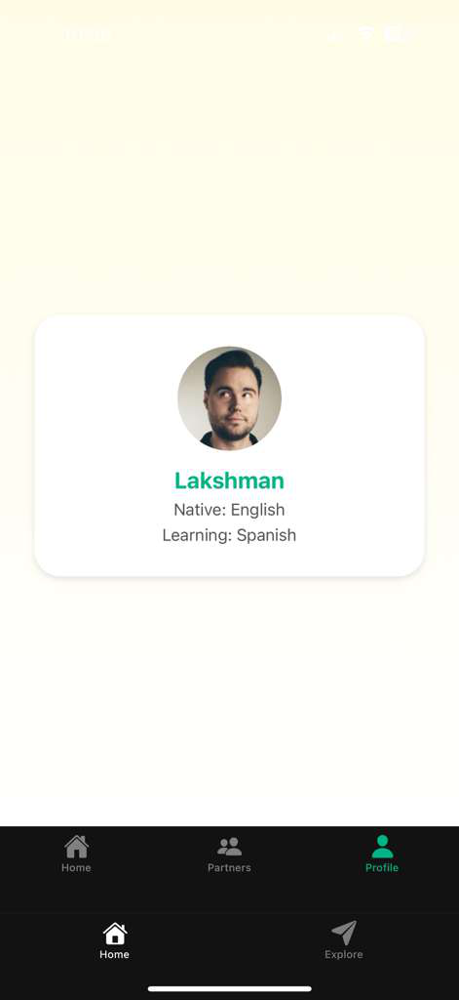

## 🌍 **LangPal App Prototype**

Built with ❤️ using **React Native (Expo)** for the **LangPal Internship Challenge**.  
A modern mobile app inspired by **Duolingo’s clean and interactive interface**, designed to connect language learners worldwide.

---
### ✨ **Features**

🏠 **Home Screen** – Smooth gradient background, LangPal logo, and animated “Find Partner” and “Start Conversation” buttons.  
💬 **Find a Partner** – List of potential language partners with their native and learning languages.  
📱 **Start Conversation** – Mock conversation preview screen showing sample chats.  
👤 **Profile Screen** – Displays user info (name, native, and learning languages).  
🌗 **Dark Mode Toggle** – Easily switch between light and dark themes.  
⚡ **Interactive Animations** – Buttons use spring animations for a fluid, delightful UI.

---
### 🧠 **Tech Stack**

- React Native (Expo)  
- TypeScript  
- React Navigation (Stack + Tabs)  
- Expo LinearGradient  
- Expo Vector Icons  
- Animated API  

---
### 📁 **Folder Structure**

LangPalApp/
- ├── app/ # Screens and navigation setup.
- ├── assets/images/ # Logo and images.
- ├── components/ # Reusable UI components.
- ├── constants/ # Color and theme configs.
- ├── scripts/ # Utility or build scripts.
- ├── app.json # App configuration.
- ├── package.json # Dependencies and scripts.
- └── README.md # Project documentation.

---

### ⚙️ **How to Run Locally**

1. **Clone this repository**

   git clone https://github.com/Luckyram1912/LangPalApp.git
   cd LangPalApp

2. **Install dependencies**

   npm install

3. **Start the app**

   npx expo start

4. **Open in Expo Go**

   Scan the QR code displayed in your terminal using the Expo Go app on your iPhone or Android device

---

### 🧑‍💻 **Developer**

**Lakshman Gunda**  
React Native | Android | Mobile Developer  
📧 gundalakshman4@gmail.com  
🔗 [GitHub Profile](https://github.com/Luckyram1912)

### 📸 Screenshots

  
  
  

  
  

